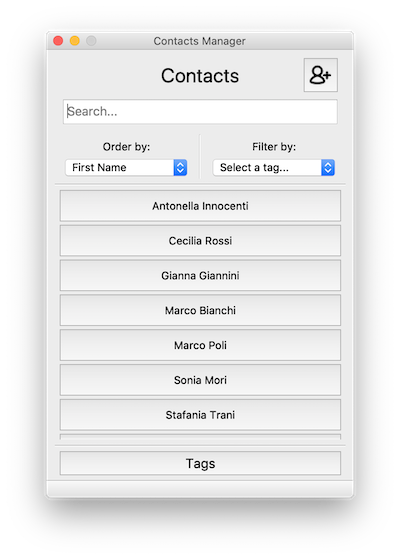
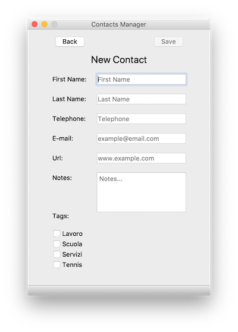

# CManager
HCI 2019-2020 Contacts Manager programming assignment.

## Implementation
The application is written in python with pyqt5 package following the Model-View-Controller architectural pattern.

### View
Views are built with QtDesigner. Python code from the *.ui* files in ui_qtdesigner folder is then generated with *build.sh* script. Python views files are located in ui folder.

The Contacts Manager application has 5 views:

1. **Contact List**: *ui/Ui_ContactList.py*

The main view of the application. It shows all the contacts initially ordered by first name in a *QScrollArea*. 

In the top right there is a 'plus' button to add a new contact. Then there is a search bar to type 'search-text' and two *QComboBox*, one to change contacts order by field (First Name or Last Name) and the other to filter contacts by tag. At the bottom of the view there is a 'Tag' button to go to tagView.
 

2. **Contact View**: *ui/Ui_ContactViewer.py*

It shows a specific contact with all its data. At the top left of the view there is a 'back' button to go back to the Contact List View and at the top right a 'save' button to edit the contact data.

3. **Contact Editor**: *ui/Ui_ContactEditor.py*

It allows the user to edit a contact. Standard field are represented as *QLineEdit*, 'Notes' field is represented as *QTextEdit* and the there is a *QScrollArea* in which are listed all the tags as *QCheckBox*. At the top right of the view there is a 'save' button to save changes. At the bottom of the view there is a 'Delete' button to delete the contact from the Contacts Manager.

4. **Contact Adder**: *ui/Ui_ContactAdder.py* 

It allows the user to add a new contact to the Contacts Manager application, adding fields data and tags. Standard field are represented as *QLineEdit*, 'Notes' field is represented as *QTextEdit* and the there is a *QScrollArea* in which are listed all the tags as *QCheckBox*. At the top left of the view there is a 'back' button to go back to the Contact List View and at the top right there is a 'save' button to add the new contact. 

5. **Tag Adder**: *ui/Ui_TagAdder.py* 

It allows the user to see existent tags and add new tags by name. At the top left of the view there is a 'back' button to go back to the Contact List View . There is a *QLineEdit* to type new tag name and a 'save' button to add the tag. Then a *QScollArea* in which are listed all existent tags.

### Controller

For each view we have a controller. 
 .contactlist_controller.py 
 
 
### Model

#### Database
The data of the appication are stored in a *SQLite* database: "*ContactsDatabase.db*".

There are three tables:

**Contacts** (**c_id**, first_name, last_name, tel, email, url, notes)

**Tags** (**t_id**, tag_name)

**ContactsTags** (***c_id***, ***t_id***) (it stores the bindings bewtween a contacts and its associated tags)

For each table there is a python class to handle it. The python files are in model folder.

In the same folder, 'contact_button_model.py' contains the class model for *ContactButton* used in the list of contacts in **Contact List**.

### Application Features
- Real Time search, anytime input changes in search bar, the app searches for the results.
- Asynchronous savings in the Contact Edit view

### Requirements
python 3.7.0

pyqt 5.9.2

sqlite 3.25.2

### Run the Application
`python main.py`
